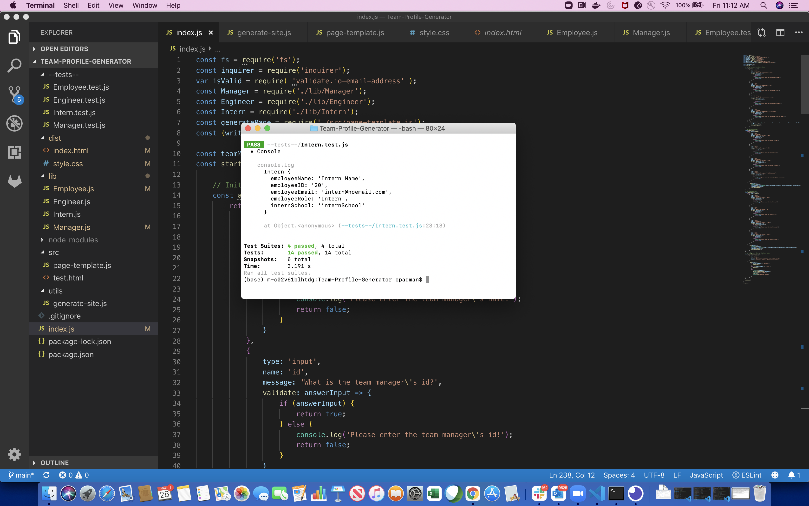
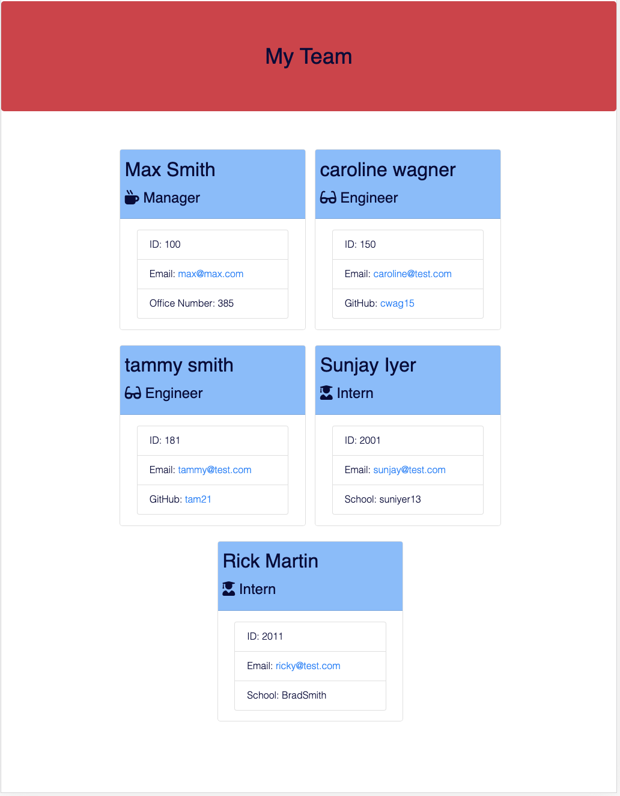

# Team-Profile-Generator

This is a Node.js application that will generate a team profile page based on user input for teams of employees.

## Installation

Clone the repositry from GitHub and open using Visual Studio Code.  Install the dependencies before using the app.

## Usage

Demo Video - https://drive.google.com/file/d/1PlkPshClgcXklEjw_6LGeD7S0OwRmOwF/view

* After installing the dependencies, go to VS code and open the integrated terminal.  
* Execute 'node index.js' from the terminal
* Add manager and employee profiles and select on 'Finish building my team' when done
* Go to index.html, right click and open in default browser.

## Test

Execute 'npm run test' from the terminal

## Screenshots

* Jest Test Results

* Employee profile object

* Team profile 

## Questions

[Contact me](chitra.iyer00@gmail.com)

[GitHub](https://github.com/ciyer87)
